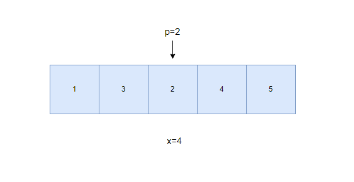

# Code Gladiators 2023

Code Gladiators is an annual coding competition by TechGig. This directory hosts my `python` based solution for the event held from 27th March - 7th August 2023.
The two problem statements are described below.
  
## Problem 1: Forest Fire (100 Marks)

You are camping in a forest area at night. You are living with the forest officers to experience their challenges and hardships to create a documentary on them. Everything was going well. Suddenly, a fire has broken out in the forest and it is expanding exponentially. There is a lot of chaos and cries of animals. It is going to take alot of time for the backup. Some of the posts in the forest have also caught fire. The officers are trying everything to safeguard the animals but the fire is spreading too fast. Amid such chaos, the petrol tankers of the officers have also caught fire. The fire is unstoppable now and the commanding officer is taking important decisions with his officers.

The officers know the energy levels of all the $N$ animals in the forest at the moment. It is a tough decision for them as they can only save exactly $X$ animals because of the current situation of the transports they have. Since, the animals are pride of the forest, the energy level of the animals are represented with $P$. _All the animals with energy level equal to $P$ or greater than $P$ can board the available transports and they will be moved to a safer place. But since the capacity is for exactly $X$ animals_ it is going to be tough to figure out.

Officer needs your help to **figure out the minimum energy level $P$ such that they can get exactly $X$ animals to transport. If it is not possible to save exactly $X$ animals, then you should respond with $-1$ so that they can think of some other plan.** The officers are busy trying to get control of the fire and are counting on you to figure out the minimum $P$ to save and transport exactly $X$ animals.

### Example & Use Case
Number of Animals, $N = 5$ with Energy Levels as ${1, 3, 2, 4, 5}$, and Current available Capacity $X = 4$, then you should chose $P = 2$, so that exactly $4$ animals with energy levels $(2, 3, 4, 5)$ can be saved as these have energies greater than or equal to $P$.

### Input Format

The **first line** of input consists of two space-separated integers, $N$ (number of animals) and $X$ (available capacity for animals that can be transported). The **second line** of input consists of N space-separated integers, representing the energy of all the animals.

**`CONSTRAINTS`**
  * Number of Animals: $1 \leq N 10^5$ 
  * Number of Animals that can be Saved: $1 \leq X \leq N$
  * Energy Level of Animals: $1 \leq A_i \leq 10^{12}$, where $A_i$ represents the energy level of $i$-th animal.

### Output Format
Print the minimum energy level $P$ such that exactly $X$ animals can be saved or transported. If it is not possible to save exactly X animals, then print `-1`.

## Disclaimer

The code commits are in-between the events, however they are hosted on GitHub (i.e. made public from this repository) after the end of event for fair play and usage. This code is shared for learning purposes, and is not shared on public domain before the end of the event.

