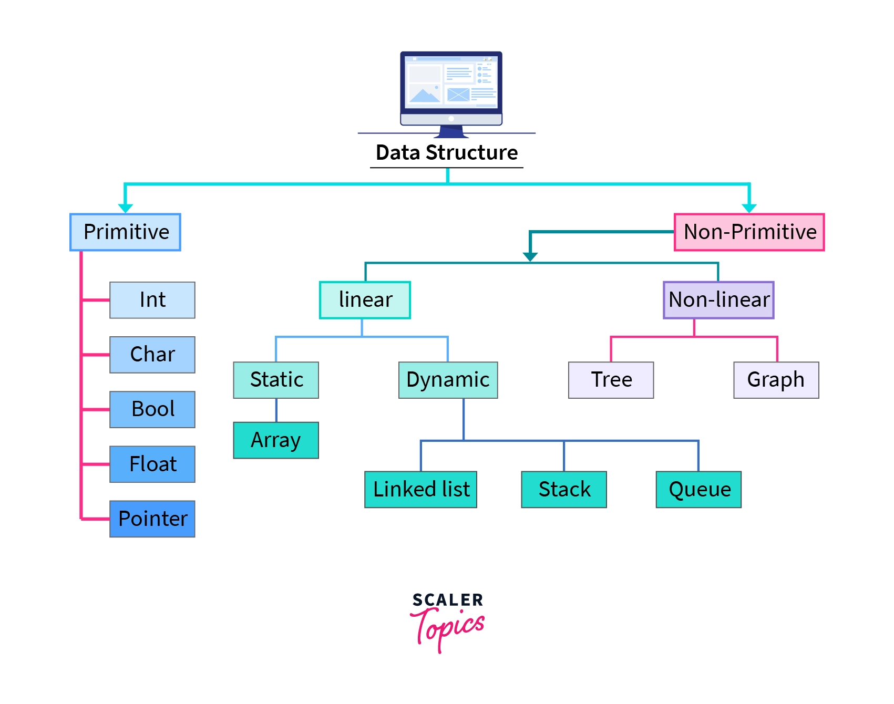

<h1 align = "center">Data Structures and Algorithms</h1>

*Data Structure* is a meaningful and efficient way of arranging and storing data in computer so as to reduce I/O overhead during mathematical computations.

## Basic Terminology

Well, simply `data + structure = data structure`, but to understand more concepts, let's define and/or define some basic terminology:

* **Data:** Representation of certain information, contextual facts, measurements, etc. which can be analysed, processed to create meaningful information.

* **Database:** A place where data is stored in computer.

* **Algorithms:** A process of doing informations.

* **Complexity:** A process of determining how fast or how "efficient" and algorithm can perform its task.

## Types of Data Structure

Data Structure can be broadly classified into two categories:

1. **_Primitive_ Data Structure** also known as *built-in* data-types that can store only one type of data. Example `int`, `float`, etc.

2. ***Non-Primitive* Data Structure** can store variety of data types which are derived from *built-in* data types. Example `array`,`trees`, `graphs`, etc.

## Resources

1. [Data Structures and Algorithms Tutorial - Scaler Topics](https://www.scaler.com/topics/data-structures/)

