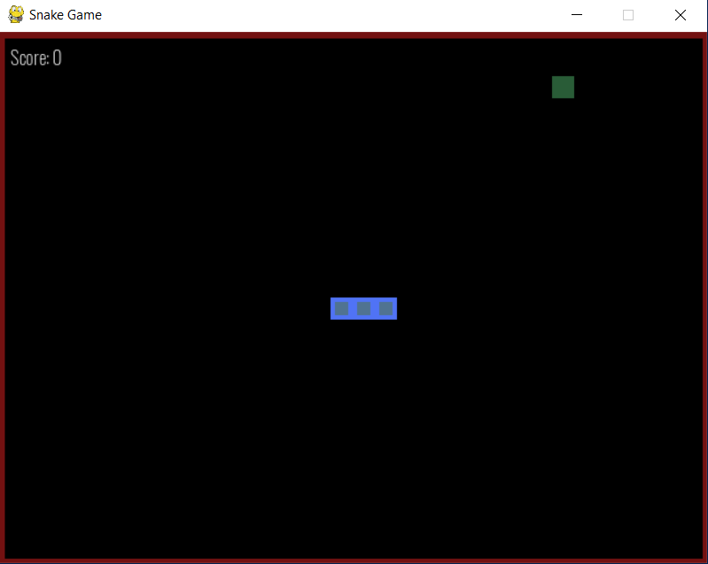
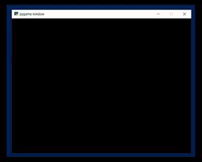

<h1 align = "center">Snake Game</h1>

<p align = "justify">In this project, a DQN Model is developed where the <code>agent</code> (snake) learns to eat food, as that in the classical snake game, by avoiding walls and eating self.</p>

## Environment
<p align = "justify">A simple environment which is enclosed in a wall boundary and the snake is allowed to move in the whole board, avoiding walls and eating self. Apart from this, there is a food which is randomly located, and the snake is awarded a positve score of 10 when it is able to eat the food, when he dies then negative score is awarded. The food is colored with a greenish tint, and an initial score of 0.</p>



<p align = "justify"><b>NOTE:</b> Initially the snake is always starts at the same position and is directed to move right. (TODO: randomize) However, the food location is randomized.</p>

## Agent
<p align = "justify">The snake is represented with a blue-ish color. To control coloring configure the same using <a href = "../config/snake.json">config</a> file.</p>

### Gameplay
<p align = "justify">The model is deveoped such that it supports standalone play by setting <code>enableAI = False</code>. To control the game using outside function (which in this case is the DQN Model) set <code>enableAI = False</code>. The initial size of the snake can also be controlled by setting <code>initial_snake_length = value</code>.</p>

```shell
DQNLearning/engine$ python snake.py # play the game using arrow keys
```

User played snake game (with snake movement speed of 5) is shown below.


